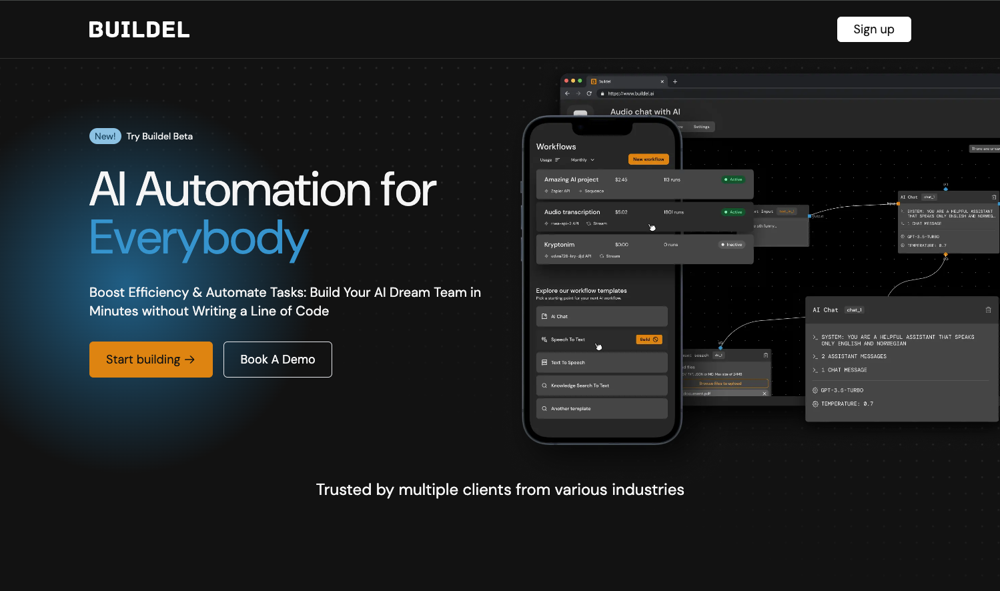
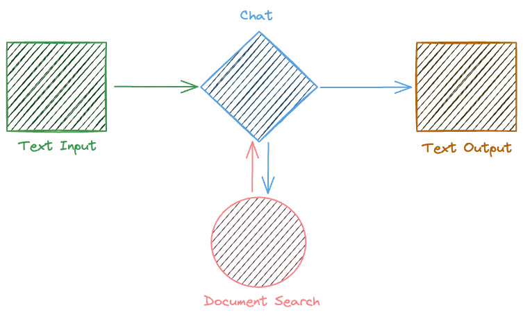
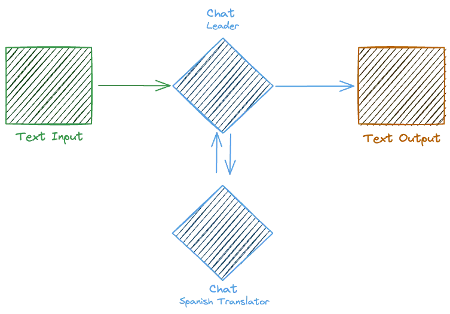
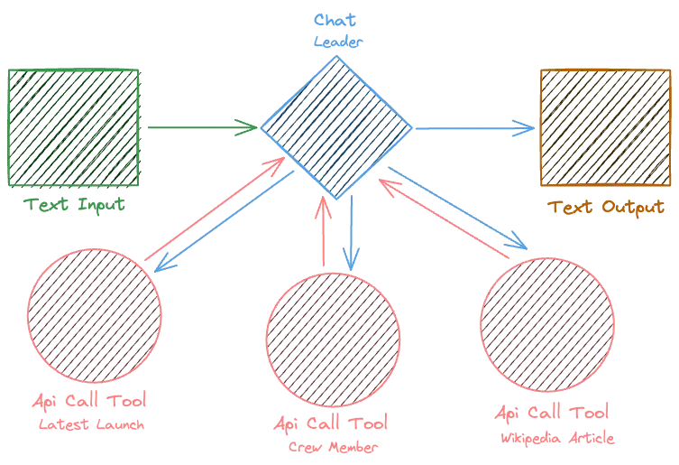

###

<h1 align="center">
  <a href="https://buildel.ai/">
      
  </a>
</h1>

<p align="center">✨AI Automation for Everybody!</p>

<p align="center">
    <a href="https://github.com/elpassion/buildel/releases">
        
    </a>
    <a href="https://github.com/elpassion/buildel">
        
    </a>
    <a href="https://discord.gg/SUXs7FyRT2">
        
    </a>
    <a href="https://github.com/elpassion/buildel/actions/workflows/web-test.yml">
        
    </a>
</p>

<p align="center">Boost Efficiency & Automate Tasks: Build Your AI Dream Team in Minutes without Writing a Line of Code.</p>

<p align="center">
  <a href="#introduction">Introduction</a> •
  <a href="#features">Features</a> •
  <a href="#examples">Examples</a> •
  <a href="#development">Development</a> •
  <a href="#links">Links</a> •
  <a href="#community">Community</a> •
  <a href="#license">License</a>
</p>

<p align="center">
    
</p>

## Introduction
[Buildel](https://buildel.ai/) is a platform designed to empower users to create versatile and dynamic workflows tailored to their specific needs. 
With an intuitive, modular approach, Buildel allows you to assemble workflows from a variety of blocks, including text input/output, chat interfaces, document search capabilities, and API-call tools, among others. 

This flexibility makes it ideal for a wide range of applications, from AI-powered document retrieval systems and sophisticated conversational interfaces to complex data integration frameworks.

## Features 

* 🔀 Multiple Providers - We support multiple providers for the same type of block. Use OpenAI, Google, Mistral and many more.
* 💻 Different Interfaces - You can build different interfaces for the same workflow. Use chat, api, or any other interface.
* 📖 Open Source - Buildel is open source. You can host it for free on your own and contribute to it.
* 🚀 Pre-built Use Cases - We have pre-built use cases that you can use to get started quickly.
* 🧩 No Code Required - You don't need to write a single line of code. Just pick and connect the blocks and you are good to go.
* 🔑 Bring Your Own Keys - You can use your own API keys for the blocks that need them.


## Examples 
Below are examples of workflows you can create to enhance your projects with dynamic, AI-powered solutions:

#### Memory

This setup is an AI-powered document retrieval system that can understand natural language queries and provide precise, contextually relevant information from a vast repository of documents.

<p>
    
</p>

Ideal for customer support, research, and educational purposes, this workflow simplifies complex search tasks into an intuitive chat experience.

#### Multiple Models

This configuration is designed for creating a highly efficient, AI-driven conversational system where a primary chat block (leader) intelligently delegates specific tasks to a secondary chat module.

<p>
    
</p>

#### Api call tools

This advanced workflow configuration is tailored for implementing a powerful, AI-guided system capable of executing diverse HTTP operations via multiple API-call tools, each uniquely configured for specific tasks.

<p>
    
</p>

The ingenuity of this setup lies in the leader chat's ability to dynamically interact with a suite of API-call tools based on the context and requirements of user queries.

## Usage

You can get started immediately at [app.buildel.ai](https://app.buildel.ai/). 
The website provides an overview of the application, additional information on the product and guides can be found in the docs.


## Development

Alternatively, instead of using the hosted version of the product, [Buildel](https://app.buildel.ai/) can be run locally.

#### How to run locally?
To be able to start Buildel locally, make sure that you have the following prerequisites installed:
- [Node.js](https://nodejs.org/en/download)
- [Elixir/Erlang](https://elixir-lang.org/install.html)
- [Docker](https://docs.docker.com/engine/install/)
- [Git](https://git-scm.com/book/en/v2/Getting-Started-Installing-Git)

Then:
1. Clone the repository:

```bash
git clone https://github.com/elpassion/buildel.git
```

2. Install dependencies:
```bash
pnpm i
```

3. Run dependencies:
```bash
pnpm dependencies:up
```
4. Run migrations:
```bash
cd apps/api
mix ecto.migrate
```

5. Run app:
```bash
pnpm dev
```

## Links
 - [Website](https://buildel.ai/) overview of the product.
 - [Buildel App](https://app.buildel.ai/) hosted version of the Buildel.
 - [Discord](https://discord.gg/SUXs7FyRT2) for support and discussions with the community and the team.
 - [Github](https://github.com/elpassion/buildel) for source code, project board, issues, and pull requests.
 - [Swagger](https://buildel.ai/) for API documentation.

## Community

Not sure where to start? Join our discord and we will help you get started!

<a href="https://discord.gg/SUXs7FyRT2">
  
</a>


## License 

GNU AFFERO GENERAL PUBLIC LICENSE
Version 3, 19 November 2007


<p style="font-weight: lighter; font-size: 12px">
  Powered by
  <a href="https://www.elpassion.com/">
    
  </a>
</p>
